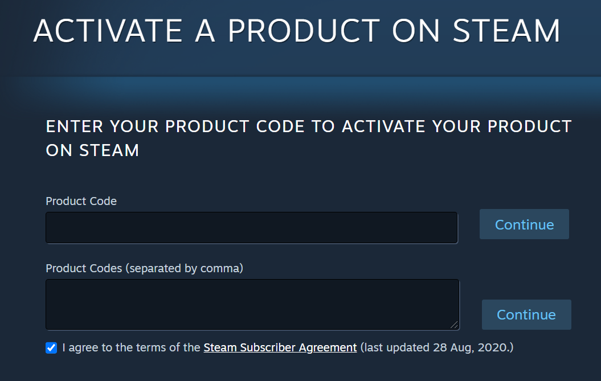
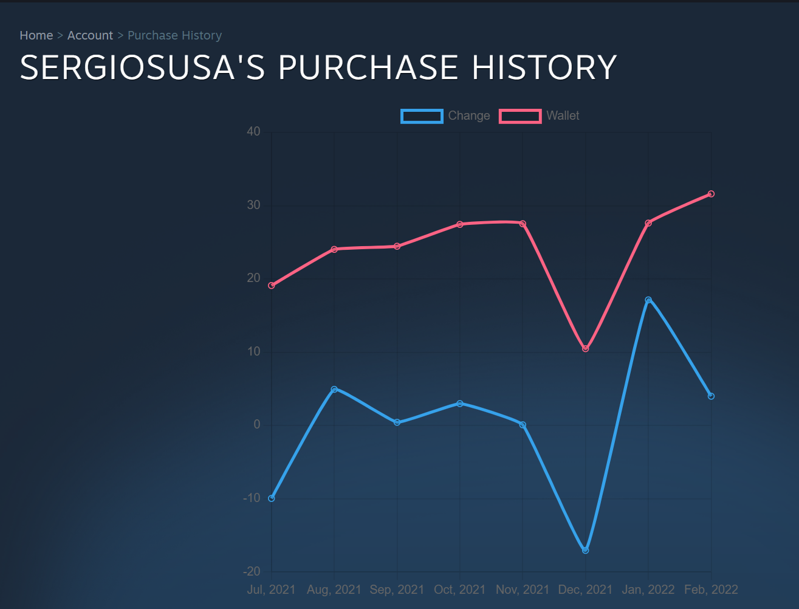
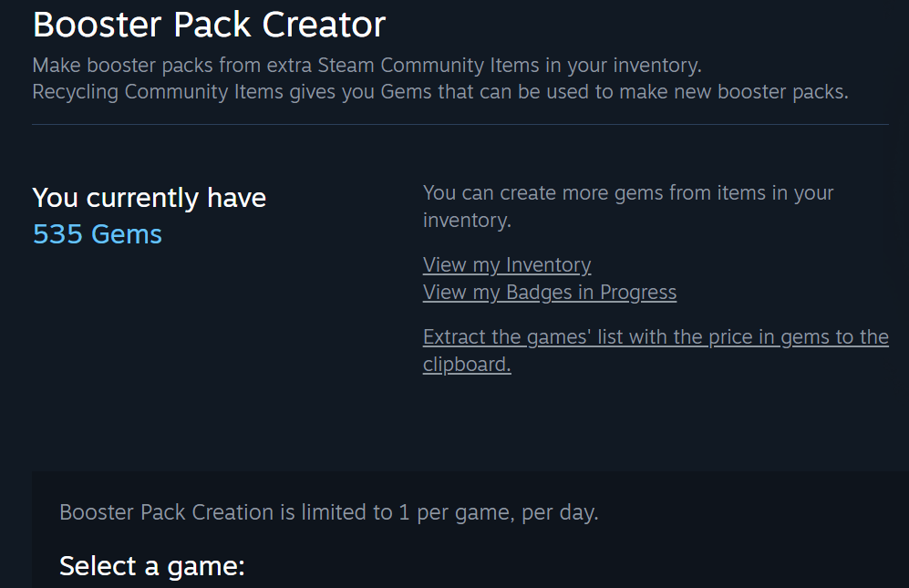
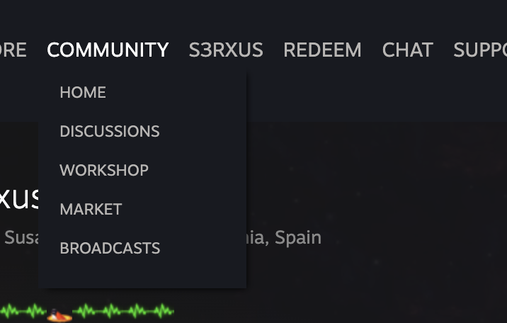

# ✨ Steam Enhanced ✨

This script enhanced the famous marketplace **[Steam](https://store.steampowered.com/)** adding:

* Add a massive game activation option to [register key page](https://store.steampowered.com/account/registerkey).
* Add a chart of balance evolution and portfolio movements to [purchase history page](https://store.steampowered.com/account/history/).
* Add an option to extract all booster packs prices in gems from [booster pack creator page](https://steamcommunity.com//tradingcards/boostercreator).
* Add an extra button in all menu across the site to link games activations page.

### Supported sites

- [Steam](https://store.steampowered.com/)

## 📌Prerequisites📎

- [Tampermonkey (Chrome)](https://tampermonkey.net)
- [Greasemonkey (Firefox)](http://www.greasespot.net)
- [Violent monkey (Opera)](https://addons.opera.com/sk/extensions/details/violent-monkey/)

## 🖥️Installation🖱️

**Github**

- Enter to the user script file (usually named as <code>*.user.js</code>) you want to install.
- Click on the <code>Raw</code> button, the browser extension will recognize this file as a user script.
- Install it.

That's it!

## 🔧Configuration🔧

No extra configuration required.

## 📷Screenshots📷

### ☕Buy me a coffee☕

If you want to support my scripts consider to use:

- My Amazon [affiliate link](https://amazon.es/?tag=sergiosusa-21) or add this query string ``?tag=sergiosusa-21`` before add a product to the basket when you buy on Amazon spain.
- My Letyshops [referal link](https://letyshops.com/es/winwin?ww=17530599) to get €5 each.
- My Payme [link](https://paypal.me/sergiosusa?locale.x=es_ES) to send me a tip.